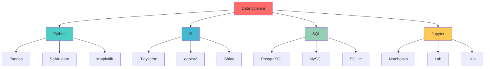

  
  # 🚀 **Mikhail Bovt** 
  
  ### *Data Scientist & Analytics Expert*
  
  
  
  
  
  
  

---

## 🎯 **What I Do**

  
  > *"Data is the new oil, and I'm the refinery that turns raw information into golden insights!"* 🎯✨
  

### 🔥 **Core Competencies**

<table>
<tr>
<td width="50%">

#### 📊 **Data Analysis & Statistics**
- Advanced statistical modeling
- Hypothesis testing & A/B testing
- Predictive analytics
- Time series analysis
- Experimental design

#### 🐍 **Python Ecosystem**
- Pandas, NumPy, SciPy
- Scikit-learn, TensorFlow
- Matplotlib, Seaborn, Plotly
- Streamlit, FastAPI
- Data cleaning & preprocessing

</td>
<td width="50%">

#### 📈 **R Programming**
- Tidyverse ecosystem
- Statistical modeling
- Data visualization (ggplot2)
- R Markdown & Shiny
- Biostatistics & research

#### 🗄️ **Data Engineering**
- SQL (PostgreSQL, MySQL, SQLite)
- Database design & optimization
- ETL processes
- Data warehousing
- API development

</td>
</tr>
</table>

---

## 🌍 **My Journey**

Born in **Russia**, raised in **Vietnam**, lived in **Canada**, and currently studying in **Singapore**. My multicultural journey has shaped my perspective on data and analytics across different cultures and markets.

### 🎵 **Personal Vibes**
- **Lo-Fi Enthusiast**: I work best with lo-fi beats in the background
- **Guitar Player**: When I'm not crunching numbers, you'll find me playing guitar
- **Ocean Lover**: I love the sea and evening walks while listening to music
- **Design Aficionado**: I like when everything is well-designed

---

## 🛠️ **Tech Stack**

```mermaid
graph TD
    A[Data Science] --> B[Python]
    A --> C[R]
    A --> D[SQL]
    A --> E[Jupyter]
    
    B --> F[Pandas]
    B --> G[Scikit-learn]
    B --> H[Matplotlib]
    
    C --> I[Tidyverse]
    C --> J[ggplot2]
    C --> K[Shiny]
    
    D --> L[PostgreSQL]
    D --> M[MySQL]
    D --> N[SQLite]
    
    E --> O[Notebooks]
    E --> P[Lab]
    E --> Q[Hub]
    
    style A fill:#ff6b6b
    style B fill:#4ecdc4
    style C fill:#45b7d1
    style D fill:#96ceb4
    style E fill:#feca57
```

---

## 📚 **Projects & Achievements**

| 🏆 **Category** | 📋 **Description** | 🎨 **Technologies** |
|----------------|-------------------|---------------------|
| **📊 Data Analysis** | Customer segmentation & behavior analysis | Python, Pandas, Scikit-learn |
| **🔮 ML Models** | Predictive models for business forecasting | R, TensorFlow, SQL |
| **📈 Dashboards** | Interactive business intelligence tools | Streamlit, Plotly, HTML/CSS |
| **🗄️ Database Design** | Optimized data warehouse solutions | PostgreSQL, ETL pipelines |
| **📝 Research** | Statistical analysis & academic papers | R, LaTeX, Jupyter |

---

## 🌟 **Why Choose Me?**

> *"I don't just analyze data – I tell stories with it!"* 📖✨

- 🎯 **Results-Driven**: Every analysis leads to actionable insights
- 🚀 **Fast & Efficient**: Optimized workflows for quick turnaround
- 🎨 **Beautiful Visualizations**: Data that's not just informative, but stunning
- 🔍 **Attention to Detail**: No stone left unturned in data exploration
- 📚 **Continuous Learning**: Always staying ahead of the curve
- 💡 **Creative Solutions**: Thinking outside the box for unique problems

---

## 📫 **Let's Connect!**

---

## 🎉 **Fun Facts About Me**

- 🎵 I code listening to lo-fi
- 🌊 I like music 
- 🎨 I like when everything is well-designed

---

*Made with ❤️ and lots of ☕ by Mikhail Bovt*

